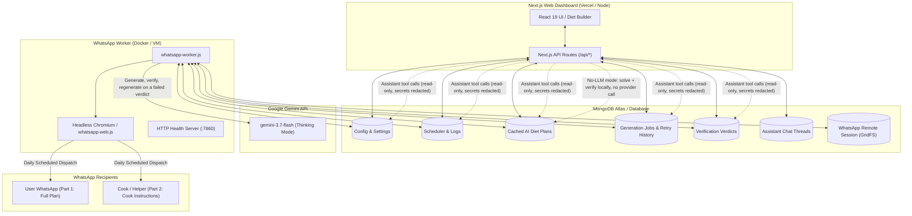

# 🥗 AI Diet Maker & WhatsApp Automation

An intelligent, full-stack nutrition planning dashboard and automated WhatsApp delivery system. **AI Diet Maker** leverages Google Gemini (`gemini-3.7-flash` with reasoning/thinking support) to generate precise, macro- and micro-balanced daily meal plans, and delivers customized instructions directly to you and your cook via WhatsApp.

---

## 🌟 Key Features

### 🍽️ Dynamic Diet Planner & Builder
- **Global Nutritional Targets**: Set daily calorie goals, total olive oil split percentages, and ideal Sodium-to-Potassium ($Na:K$) balance ranges (0.70–0.80).
- **Custom Meals & Ingredients**: Configure multiple meals with drag-and-drop reordering, per-meal/daily cooking quantity modes, and custom prep methods.
- **Smart Auto-Calculated Ingredients**: Mark ingredients as `[AUTO]` with optional `min` and `max` gram constraints. The AI automatically solves for exact weights to meet your daily caloric and macro targets.
- **Personal-Only Ingredients**: Flag sensitive or personal items (e.g., supplements, whey protein) to keep them in your full nutritional breakdown (Part 1) while automatically omitting them from the cook's preparation instructions (Part 2).
- **Daily Variables & Custom Splits**: Customize day-by-day variations (Monday–Sunday) for vegetables, carbs, and custom seasoning/salt splits.
- **Live System Prompt Preview**: Real-time prompt compiler with side-by-side prompt inspection and custom prompt override capabilities.

### 🧠 Gemini AI Generation & Smart Caching
- **Gemini AI Integration**: Supports Google AI Studio (API Key) and Gemini Enterprise / Vertex AI (API Key, Service Account JSON, or ADC).
- **Thinking Level Support**: Pick a Gemini 3 thinking depth (`default`/`low`/`medium`/`high`, sent as `thinkingConfig.thinkingLevel`) with live preview of the AI's internal thought process.
- **Output & Reasoning Controls**: Set **Max Output Tokens** per provider (blank = provider default: 16,384 on Fireworks, the model's own limit on Gemini) and pick a model-compatible **Reasoning Effort** for Fireworks reasoning models. The dashboard filters unsupported levels and resets incompatible saved selections to the model default before sending `reasoning_effort`; both controls apply to dashboard generation and the WhatsApp worker.
- **Structured Dual-Part Output**:
  - **Part 1 (User Plan)**: Complete nutrition tables, macros (protein, carbs, fat, fiber), micro-nutrients (sodium, potassium), and meal schedules.
  - **Part 2 (Cook Instructions)**: Clean, cook-friendly preparation instructions, ingredient weights, and seasoning splits in clear language.
- **Hash-Based MongoDB Caching**: Hashes full configuration state to cache generated plans per day. Unchanged days load instantaneously with zero API latency. A model-written plan and a computed one never share a cache entry, so switching engines regenerates rather than reusing.
- **Batch 7-Day Generation**: Generate all 7 days of the week in a single batch with live progress tracking.

### 🧮 No-LLM Mode (Deterministic Plan Builder)
- **Compute Instead of Generate**: A **Compute without AI** switch beside the generate button swaps the model out for a solver. The `[AUTO]` weights are solved, both parts of the document are written, and the day is cached — with no provider call, no API key and no worker running.
- **Same Arithmetic, Both Directions**: The builder uses the verifier's own reference-table lookup, per-day ingredient grouping and calorie-budget solver, so a computed plan is judged by exactly the arithmetic that produced it. Every day it writes passes the checker with zero errors and zero warnings.
- **Exact Targets**: The AUTO weights are solved so the day's calories land on the target (within a fraction of a kcal), every `min`/`max` bound is respected, and the calorie split is steered to put the Na:K ratio inside the ideal band whenever that band is reachable.
- **Even Split by Default**: Calories are spread evenly across the `[AUTO]` ingredients unless that lands the ratio outside the band, in which case the split shifts just far enough to reach it. When the band is physically unreachable the plan lands on the closest ratio the ingredients allow and says so in as many words.
- **Instant and Free**: Runs inside `/api/generate` in milliseconds, so there is no queue, no streaming, no retry budget and no token cost. The **Thoughts** tab shows the derivation instead of a model's reasoning: the calorie budget, each solved weight with its bounds, and the resulting totals.
- **Refuses to Guess**: A model can fall back on "standard USDA values" for an ingredient the reference table does not list; arithmetic cannot. Those configs are refused by name rather than quietly costed at zero, as are `[AUTO]` bounds no weight can satisfy.
- **Scheduler Support**: The WhatsApp scheduler honours the same setting, so a daily dispatch can generate its missing day locally with no credentials configured at all.

### ✅ Plan Verification & Automatic Retries
- **Deterministic Arithmetic Checker**: Every number in a generated plan is re-derived from the same reference nutrition table the model was given — per-row and per-meal calories, macros, sodium/potassium, the Na:K ratio, AUTO weight bounds, and whether the cook's copy matches Part 1. No model is involved, so the checker cannot be talked out of a number.
- **Automatic Post-Generation Verification**: Every generated plan is verified as part of the same durable job, before the run is reported as finished. Verification is not a separate step the user has to remember.
- **Regenerate Until It Passes**: A plan the checker rejects is regenerated with the exact findings appended to the original prompt, up to a configurable retry budget (**3 retries by default**, so at most 4 generations per day). The loop stops the moment the arithmetic pass comes back clean. If the budget runs out, the last plan is kept and its failing verdict is shown rather than hidden.
- **Full Retry History**: Every attempt — including the ones whose plans were thrown away — is stored on the generation job and shown per day in the dashboard's **Verification** tab, with the findings that got each attempt rejected one click away.
- **Optional Second-Opinion AI Review**: A separately configurable provider/model can read the plan for instructions it ignored, unusable steps, and claims its own numbers do not support. Its findings are advisory: only the arithmetic pass decides pass/fail and therefore whether a retry happens.
- **Honest Feedback**: When a configured target is physically unreachable for a day (e.g. no combination of the day's ingredients can hit the Na:K range), the retry prompt says so explicitly and instructs the model to report its real numbers instead of forcing them into range.

### 💬 Diet Assistant (Read-Only Database Agent)
- **Chat Grounded in Your Own Data**: A dedicated **Assistant** tab where you can ask about your meals, targets, any day's generated plan, or its verification verdict. Answers are built from tool calls against the live database, not from the model's memory of the conversation.
- **Strictly Read-Only**: The assistant reaches the database through a tool layer that only ever runs `find` / `count`. There is no code path from chat to a write, a plan generation, or a WhatsApp send. When something needs changing it tells you what and where, and you make the change.
- **Secrets Never Leave the Server**: API keys, the service-account JSON, the Hugging Face token and the WhatsApp login QR are redacted at every nesting depth before any document reaches the model — so "read the config" cannot become "read my credentials back to me".
- **Query Guardrails**: Collections are whitelisted, expression operators (`$where`, `$function`, `$expr`, …) are refused, results are capped at 25 documents and 24 KB per call, and long plan text is truncated in generic queries so one wide read cannot flood the context.
- **Visible Reasoning Trail**: Each lookup is streamed to the UI as it runs ("Reading the plan · MONDAY"), and stored with the answer as an expandable trace, so you can see exactly which records an answer came from.
- **Stale-Aware**: Plans and verdicts carry the config hash they were produced under, and the assistant is told to flag an answer built on a plan the configuration has since moved past.
- **Saved Conversations**: Threads persist in MongoDB, so past advice is still there after a reload. This is the only thing the assistant flow writes — and the app writes it, not the agent.
- **Independently Configurable Model**: Like plan verification, the assistant defaults to reusing the generation provider/model but can point somewhere faster, since one question can mean several model calls in a row.

### 📲 WhatsApp Automation & Daily Scheduler
- **Headless WhatsApp Client**: Built on `whatsapp-web.js` and Puppeteer running in a dedicated background worker.
- **In-Dashboard QR Pairing**: Scan WhatsApp Web QR code directly from the web dashboard.
- **Persistent Remote Session**: WhatsApp session state is stored in MongoDB GridFS, surviving container restarts, deployments, and reboots without re-scanning.
- **Timezone-Aware Auto-Scheduler**: Schedule daily automated dispatches at any time in your local timezone (e.g., `Asia/Kolkata`, `America/New_York`, `UTC`).
- **Dual-Recipient Routing**: Automatically sends Part 1 (Full Diet Plan) to your personal chat and Part 2 (Cook Instructions) directly to your cook or household group.
- **Manual Test Triggers & Diagnostics**: One-click test sending ("Send All", "Send Cook Only", "Send Myself Only") and live worker logs & health checks.

### 🔒 Access Control & Security
- **Password Protection**: Secure dashboard access gated behind an application password (`APP_PASSWORD`) with cookie-based session verification.

---

## 🏗️ Architecture Overview



---

## 🛠️ Tech Stack

- **Framework**: [Next.js 16](https://nextjs.org/) (App Router, React 19, TypeScript)
- **Styling**: [Tailwind CSS v4](https://tailwindcss.com/)
- **Database**: [MongoDB](https://www.mongodb.com/) with [Mongoose](https://mongoosejs.com/)
- **AI & LLM**: Google Gemini API via [`@google/genai`](https://www.npmjs.com/package/@google/genai) & REST API
- **WhatsApp Engine**: [`whatsapp-web.js`](https://wwebjs.dev/) with Puppeteer & [`wwebjs-mongo`](https://www.npmjs.com/package/wwebjs-mongo) (GridFS session storage)
- **Containerization & Deployment**: Docker, GitHub Actions, Oracle Cloud VM, Hugging Face Spaces, GCP VM, Vercel

---

## 🚀 Getting Started

### Prerequisites

- **Node.js**: v20 or higher
- **MongoDB**: A running MongoDB instance (e.g., [MongoDB Atlas](https://www.mongodb.com/cloud/atlas))
- **Google Gemini API Key**: Obtainable from [Google AI Studio](https://aistudio.google.com/)

### 1. Clone the Repository

```bash
git clone https://github.com/ganganimaulik/AI-Diet-Maker.git
cd "AI Diet Maker"
```

### 2. Install Dependencies

```bash
npm install
```

### 3. Configure Environment Variables

Create a `.env.local` file in the root directory:

```bash
cp .env.example .env.local
```

Edit `.env.local` with your configuration:

```env
# MongoDB Connection String (Required)
MONGODB_URI=mongodb+srv://<username>:<password>@<cluster>.mongodb.net/diet-maker

# Dashboard Password (Optional - defaults to 'admin123' if not set)
APP_PASSWORD=your_secure_password

# Gemini API Key (Optional - can also be configured in the UI)
GEMINI_API_KEY=your_gemini_api_key_here

# Fireworks.ai API Key (Optional - required only when using the Fireworks provider)
FIREWORKS_API_KEY=your_fireworks_api_key_here

# Port for the WhatsApp worker health check server (Default: 7860)
PORT=7860
```

### 4. Run the Web Dashboard

```bash
npm run dev
```

Open [http://localhost:3000](http://localhost:3000) in your browser. Log in with your configured `APP_PASSWORD`.

### 5. Run the WhatsApp Worker (Optional for Local Testing)

To run the background WhatsApp worker locally:

```bash
node whatsapp-worker.js
```

Once started, navigate to the **Connections** tab in the dashboard to scan the QR code and pair your WhatsApp account.

---

## ⚙️ Environment Variables Reference

| Variable | Required | Default | Description |
| :--- | :--- | :--- | :--- |
| `MONGODB_URI` | **Yes** | — | MongoDB connection string for configuration, caches, and WhatsApp session storage. |
| `APP_PASSWORD` | No | `admin123` | Master password for web dashboard login. |
| `GEMINI_API_KEY` | No | — | Google AI Studio Gemini API Key (can also be entered directly in the web UI). |
| `FIREWORKS_API_KEY` | No | — | Fireworks.ai API Key, used when the provider is set to Fireworks (can also be entered directly in the web UI). Never falls back to `GEMINI_API_KEY`. |
| `PORT` | No | `7860` | HTTP port for the worker's diagnostic & health check server. |
| `PUPPETEER_EXECUTABLE_PATH` | No | *Auto-detected* | Custom path to Chromium executable if not using Puppeteer's bundled Chrome. |
| `DNS_SERVERS` | No | `1.1.1.1 8.8.8.8 1.0.0.1` | Custom DNS resolvers for the Docker container entrypoint. |

---

## 🚢 Deployment Guide

### 1. Web Dashboard (Vercel)

1. Push your repository to GitHub.
2. Import the project into [Vercel](https://vercel.com).
3. Set the environment variables in Vercel Project Settings:
   - `MONGODB_URI`
   - `APP_PASSWORD`
   - `GEMINI_API_KEY`
   - `FIREWORKS_API_KEY` (only if using the Fireworks provider)
4. Deploy!

### 2. WhatsApp Worker

The WhatsApp worker runs headless Chromium and should be hosted on an always-on container or VM.

#### Option A: Oracle Cloud Always-Free VM (Recommended)
An automated GitHub Actions workflow is provided in `.github/workflows/deploy-oracle.yml`:
1. Provision an Oracle Cloud Always-Free compute instance with Docker installed.
2. Set the following repository secrets in GitHub:
   - `ORACLE_HOST`
   - `ORACLE_USER`
   - `ORACLE_SSH_KEY`
3. Configure `~/worker.env` on the remote VM containing `MONGODB_URI` and `GEMINI_API_KEY` (plus `FIREWORKS_API_KEY` if using the Fireworks provider).
4. Pushing changes to `main` touching worker files automatically builds and redeploys the Docker container.

#### Option B: Hugging Face Spaces (Docker SDK)
The repository includes a `Dockerfile` compatible with Hugging Face Spaces:
1. Create a new Docker Space on Hugging Face.
2. Set repository secrets in GitHub:
   - `HF_TOKEN`
3. Run or enable `.github/workflows/sync-to-hub.yml` to automatically push and build on Hugging Face Spaces.
4. Add `MONGODB_URI` and `GEMINI_API_KEY` (plus `FIREWORKS_API_KEY` if using the Fireworks provider) in the Space's Settings secrets.

#### Option C: Standalone Docker Run
To build and run the worker on any server or local Docker daemon:

```bash
docker build -t diet-worker .

docker run -d \
  --name diet-worker \
  --restart unless-stopped \
  -p 7860:7860 \
  -e MONGODB_URI="your_mongodb_uri" \
  -e GEMINI_API_KEY="your_gemini_api_key" \
  -e FIREWORKS_API_KEY="your_fireworks_api_key" \
  diet-worker
```

---

## 📁 Project Structure

```
.
├── src/
│   ├── app/
│   │   ├── api/
│   │   │   ├── auth/           # Login & session check routes
│   │   │   ├── cache/          # Diet plan response cache endpoints
│   │   │   ├── chat/           # Assistant chat turns (SSE) & thread CRUD
│   │   │   ├── config/         # Diet configuration load & save endpoints
│   │   │   ├── generate/       # Durable generation job queue & status API
│   │   │   ├── verify/         # Plan verification verdicts (manual "Verify" buttons)
│   │   │   └── whatsapp/       # WhatsApp status, contacts, test sends, session reset
│   │   ├── globals.css         # Global dark theme styling
│   │   ├── layout.tsx          # Root layout
│   │   └── page.tsx            # Main application controller & views
│   ├── components/
│   │   ├── AppHeader.tsx       # App navigation header & save triggers
│   │   ├── LoginScreen.tsx     # Authentication modal
│   │   ├── assistant/          # Chat transcript, bubbles & tool-call trace
│   │   ├── connections/        # WhatsApp, Gemini API, Scheduler, & Hugging Face cards
│   │   └── planner/            # Diet builder, meal editor, daily variables, output panels
│   ├── hooks/
│   │   ├── useAssistant.ts     # Chat threads & streamed assistant turns
│   │   ├── useConfigActions.ts # Meal & split CRUD operations
│   │   ├── useDietCache.ts     # Diet plan caching & invalidation hooks
│   │   ├── useVerification.ts  # Per-day verification verdicts & manual re-checks
│   │   └── useWhatsApp.ts      # WhatsApp status & scheduler management hooks
│   └── lib/
│       ├── agent-complete.js   # Streaming tool-calling loop across all three providers
│       ├── agent-prompt.js     # Assistant system prompt
│       ├── agent-tools.js      # Read-only DB tools, redaction & query guardrails
│       ├── agent.ts            # Typed wrapper over the assistant modules
│       ├── auth.ts             # Password authentication & cookie helpers
│       ├── build-plan.js       # Deterministic plan builder (no-LLM mode): AUTO solver + renderer
│       ├── compile-prompt.js   # Dynamic prompt compiler & template engine
│       ├── compute-config-hash.js # Deterministic configuration hash generator
│       ├── ai-complete.js      # Single-shot completion across all three providers
│       ├── db.ts               # Mongoose connection manager
│       ├── gemini.js           # Gemini API client & response parsers
│       ├── generation-runner.js # Durable job lease / claim / attempt lifecycle helpers
│       ├── markdown.ts         # Markdown formatters (plan Part 1/Part 2 split, chat)
│       ├── models.js           # Mongoose schemas (Config, Scheduler, ChatThread, etc.)
│       ├── types.ts            # TypeScript interfaces & default diet configuration
│       ├── verification-runner.js # Verification pipeline & retry-feedback prompt
│       └── verify-plan.js      # Deterministic arithmetic checker (no model involved)
├── .github/workflows/          # CI/CD deployment workflows (Oracle, GCP, HF Spaces)
├── Dockerfile                  # Worker container definition with Chromium dependencies
├── docker-entrypoint.sh        # Docker startup script with DNS resolver setup
├── package.json                # Project dependencies & scripts
├── backups/                    # Sanitized MongoDB snapshots (no credentials)
├── whatsapp-worker.js          # WhatsApp worker, scheduler daemon & generation runner
└── README.md                   # Project documentation
```

---

## 📄 License

This project is private and proprietary. All rights reserved.
